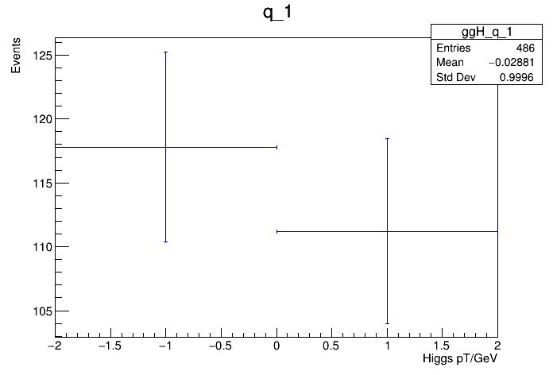
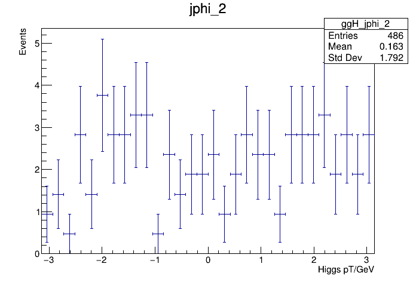
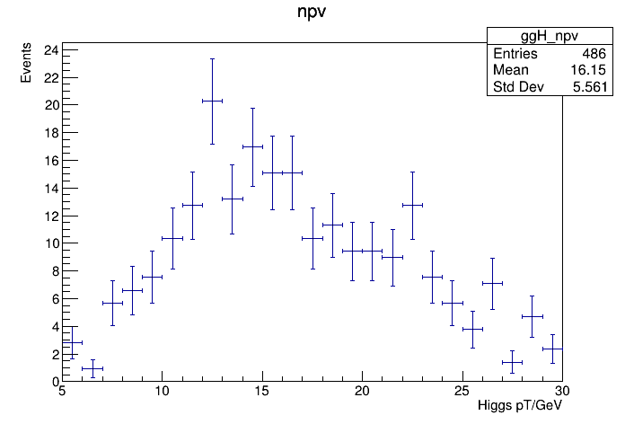
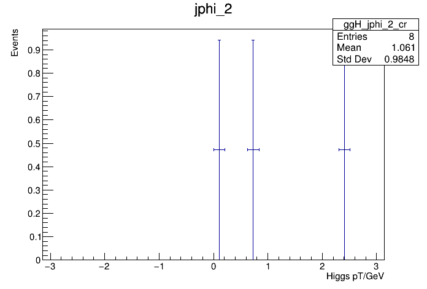

## Welcome to GitHub Pages
    
    This is a test to enable automatic publication of plots.
The following plots are from virtual-pipeline:

### ggH_pt_1

### ggH_pt_2

### ggH_eta_1

### ggH_eta_2

### ggH_phi_1

### ggH_phi_2

### ggH_iso_1

### ggH_iso_2

### ggH_q_1

### ggH_q_2

### ggH_pt_met

### ggH_phi_met

### ggH_m_1

### ggH_m_2

### ggH_mt_1

### ggH_mt_2

### ggH_dm_2

### ggH_m_vis

### ggH_pt_vis

### ggH_jpt_1

### ggH_jpt_2

### ggH_jeta_1

### ggH_jeta_2

### ggH_jphi_1

### ggH_jphi_2

### ggH_jm_1

### ggH_jm_2

### ggH_jbtag_1

### ggH_jbtag_2

### ggH_npv

### ggH_njets

### ggH_mjj

### ggH_ptjj

### ggH_jdeta

### ggH_pt_1_cr

### ggH_pt_2_cr

### ggH_eta_1_cr

### ggH_eta_2_cr

### ggH_phi_1_cr

### ggH_phi_2_cr

### ggH_iso_1_cr

### ggH_iso_2_cr

### ggH_q_1_cr

### ggH_q_2_cr

### ggH_pt_met_cr

### ggH_phi_met_cr

### ggH_m_1_cr

### ggH_m_2_cr

### ggH_mt_1_cr

### ggH_mt_2_cr

### ggH_dm_2_cr

### ggH_m_vis_cr

### ggH_pt_vis_cr

### ggH_jpt_1_cr

### ggH_jpt_2_cr

### ggH_jeta_1_cr

### ggH_jeta_2_cr

### ggH_jphi_1_cr

### ggH_jphi_2_cr

### ggH_jm_1_cr

### ggH_jm_2_cr

### ggH_jbtag_1_cr

### ggH_jbtag_2_cr

### ggH_npv_cr

### ggH_njets_cr

### ggH_mjj_cr

### ggH_ptjj_cr

### ggH_jdeta_cr

